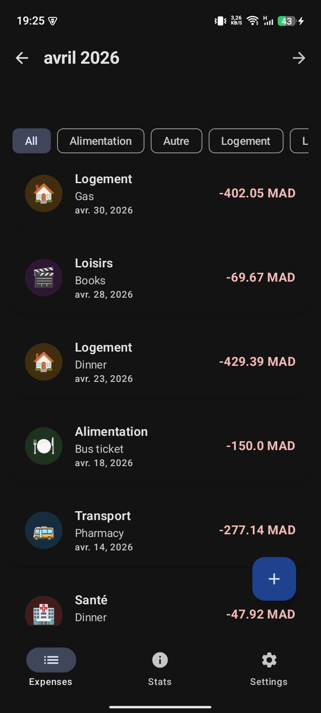
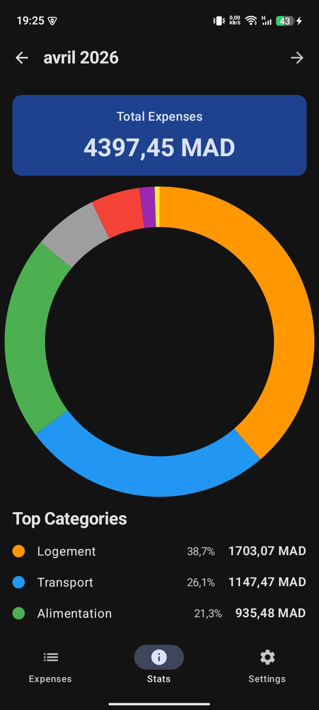
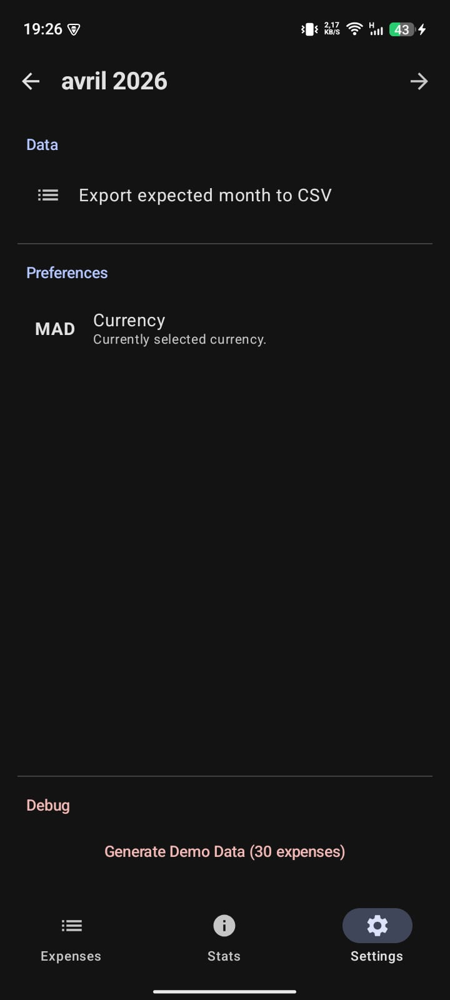

# SmartBudget — Ingénierie Financière Mobile & Architecture Réactive

[](https://kotlinlang.org)
[](https://developer.android.com/jetpack/compose)
[](https://developer.android.com/topic/architecture)

## 🎯 Vision et Mission du Projet

**SmartBudget** est une plateforme d'orchestration financière mobile conçue pour répondre aux défis complexes de la gestion budgétaire en milieu étudiant. Dans un contexte où la volatilité des dépenses et l'instabilité des revenus académiques sont monnaie courante, SmartBudget propose une solution **Offline-First**, garantissant une souveraineté totale sur les données personnelles et une latence zéro, indépendamment de la connectivité réseau.

Développé par **Yassine Kamouss** (LSI, FST Tanger), ce projet dépasse le simple cadre académique pour proposer une implémentation logicielle rigoureuse basée sur les standards de l'industrie de 2026.

---

## 🖼️ Visual Experience (Product Tour)

L'interface utilisateur respecte les canons du **Material Design 3**, privilégiant la clarté, l'accessibilité et la réactivité émotionnelle grâce à des composants hautement interactifs.

| **Expenses Management** | **Statistics Engine** | **Advanced Settings** |
| :--- | :--- | :--- |
|  |  |  |
| *Gestion CRUD réactive avec validations métier.* | *Moteur d'agrégation et Data Viz en temps réel.* | *Exportation CSV et contrôle du cycle de vie.* |

---

## 🏗️ Philosophie d'Architecture (Clean Architecture)

Le projet est structuré selon les principes de la **Clean Architecture**, assurant une séparation stricte des préoccupations (Separation of Concerns). Cette modularité garantit que la logique métier reste isolée des caprices des frameworks externes ou de l'interface utilisateur.

### 1. Domain Layer (The Core)
Le "Cerveau" de l'application, écrit en **Pure Kotlin** sans aucune dépendance au framework Android.
* **Entities** : Modèles de données métier (Expense, Category, MonthlyStats) encapsulant les règles fondamentales.
* **Use Cases** : Orchestrateurs de la logique métier (ex: `GetMonthlyStatsUseCase`, `ExportCsvUseCase`). Chaque Use Case est une unité atomique de fonctionnalité, facilitant les tests unitaires isolés.

### 2. Data Layer (Source of Truth)
Implémentation du **Pattern Repository** pour centraliser l'accès aux données.
* **Room Persistence** : Abstraction de SQLite pour une gestion performante et typée de la base de données locale.
* **Type Converters** : Transformation bidirectionnelle des types complexes (`LocalDate`, `BigDecimal`) pour assurer la cohérence SQL.

### 3. UI Layer (Presentation)
Une interface déclarative pilotée par l'état (State-driven UI).
* **MVVM Pattern** : Utilisation de `ViewModel` pour découpler l'UI de la logique de présentation et assurer la survie de l'état lors des changements de configuration.
* **UDF (Unidirectional Data Flow)** : Les événements utilisateur montent vers le ViewModel, et l'état de l'interface descend de manière prédictible via `StateFlow`.

---

## 🛠️ Stack Technique & Choix d'Ingénierie

Chaque composant de la stack a été sélectionné pour sa robustesse et sa pérennité au sein de l'écosystème Android moderne.

* **Jetpack Compose** : Toolkit UI déclaratif pour une interface dynamique et performante.
* **Dagger Hilt** : Injection de dépendances (DI) standardisée pour simplifier le cycle de vie des objets et améliorer la testabilité.
* **Kotlin Coroutines & Flow** : Gestion asynchrone des flux de données pour des calculs de statistiques fluides sans bloquer le thread principal (UI).
* **KSP (Kotlin Symbol Processing)** : Processeur de symboles de nouvelle génération pour Room et Hilt, réduisant drastiquement les temps de compilation.
* **Timber** : Logging extensible permettant une gestion propre des journaux d'erreurs en phase de développement.

---

## 🚀 Fonctionnalités Avancées (Deep Dive)

### 📊 Moteur de Statistiques & Data Visualization
SmartBudget intègre un moteur d'agrégation capable de transformer des milliers de transactions brutes en informations actionnables.
* **Agrégation Réactive** : Utilisation de l'opérateur `combine` pour fusionner les flux de catégories et de dépenses, mettant à jour les graphiques instantanément.
* **Suivi Budgétaire** : Mise en place de seuils critiques. Les indicateurs visuels (`LinearProgressIndicator`) passent dynamiquement au rouge dès que 90% du budget alloué est consommé.

### 📥 Interopérabilité : Exportation CSV
Pour garantir la portabilité des données, SmartBudget permet aux utilisateurs d'extraire leurs rapports financiers pour un usage externe.
* **Export ISO Standard** : Génération de fichiers CSV conformes pour une importation directe dans Excel ou Google Sheets.
* **Sécurité via FileProvider** : Partage sécurisé des fichiers générés via l'Android Sharesheet (`Intent.ACTION_SEND`).

### 🛠️ Système de Simulation (Demo Data)
Afin de faciliter l'évaluation, un module de "Seeding" a été implémenté.
* **30 Dépenses Réelles** : Génération automatique d'un historique sur deux mois (Logement, Transport, Alimentation) pour valider immédiatement la puissance du moteur de statistiques et de navigation temporelle.

---

## 💎 Standards d'Excellence & Qualité Logicielle

En tant qu'application financière, SmartBudget ne tolère aucune approximation.
* **Précision Monétaire** : Utilisation systématique de `BigDecimal` (et non `Double/Float`) pour tous les calculs afin d'éviter les erreurs d'arrondi binaire critiques dans les applications bancaires.
* **Validation des Inputs** : Chaque entrée est filtrée et validée (montants positifs, dates cohérentes) au niveau de la couche Domain avant toute persistance.
* **Performance Optimisée** : Collecte des données via `collectAsStateWithLifecycle` pour une gestion optimale des ressources énergétiques du smartphone.
* **UX Native** : Intégration de gestes intuitifs (Swipe-to-dismiss) pour la suppression, accompagnés de dialogues de confirmation et de Snackbars avec action d'annulation (Undo).

---

## ⚙️ Installation & Workflow de Développement

Pour compiler et déployer l'application sur un environnement de test :

1.  **Clonage du Repository** :
    ```bash
    git clone [https://github.com/yassinekamouss/smartbudget.git](https://github.com/yassinekamouss/smartbudget.git)
    ```
2.  **Initialisation Android Studio** :
    * Ouvrir le projet avec **Android Studio Ladybug (2024.2+)** ou supérieur.
    * Lancer la synchronisation Gradle (**Sync Project with Gradle Files**).
3.  **Compilation** :
    * Exécuter `Build > Clean Project` pour initialiser les générateurs KSP.
    * Lancer le build via `Run` ou `Shift + F10`.
4.  **Environnement de Test** :
    * Min SDK : 26 (Android 8.0 Oreo).
    * Target SDK : 35 (Android 15).

---

## Auteur

**Auteur** : [Yassine Kamouss](https://github.com/yassinekamouss)
**Formation** : Cycle Ingénieur LSI, Faculté des Sciences et Techniques (FST) de Tanger.

---

> *"L'ingénierie logicielle ne consiste pas à écrire du code, mais à construire des solutions qui résistent au temps et à l'usage."*